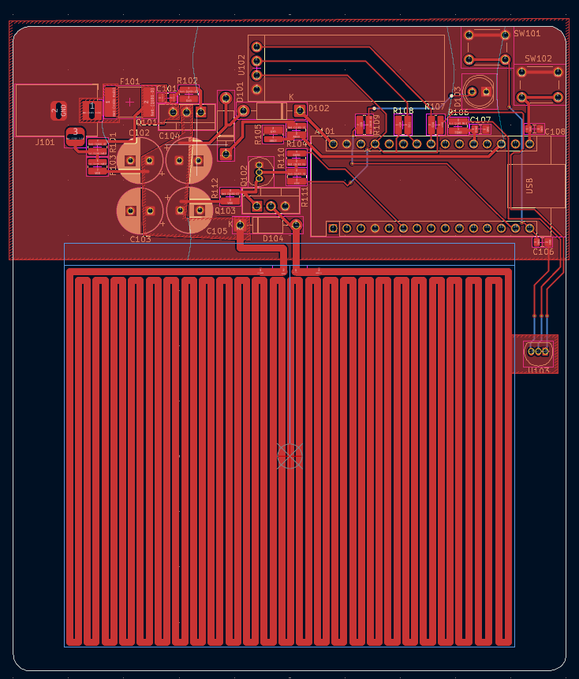
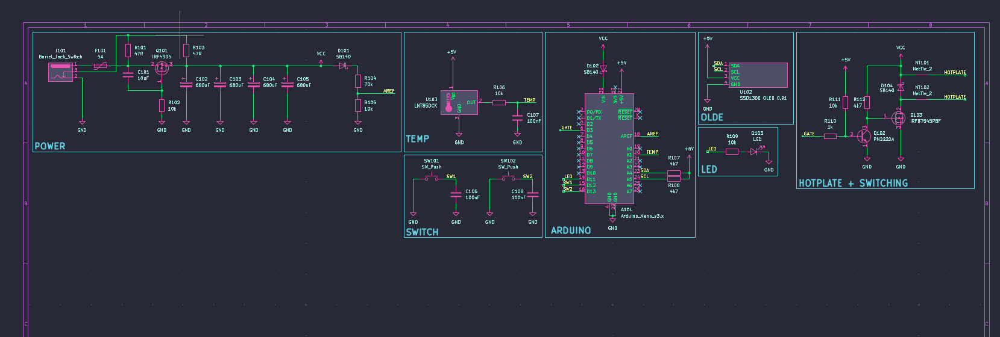

# PCB Hotplate Project (KiCad)
## PCB Layout:

## Schematic: 

## Overview

This project is a PCB hotplate designed using KiCad.

The board controls a heating element and maintains temperature using a simple control system.
It was designed for small electronics tasks such as soldering and component heating.

The focus was PCB layout, power handling, and thermal considerations.

## Objectives

Design schematic in KiCad

Create custom PCB layout

Handle higher current safely

Separate power and control sections

Apply proper trace width for heating load

## Tools Used

KiCad

ERC and DRC checks

PCB layout editor

3D viewer

## System Design

The board includes:

Power input section

Heating element output

Control circuit

Switching device (MOSFET or transistor)

Protection components

Power traces are wider to handle higher current.
Signal traces are separated to reduce noise.

## Design Considerations

Calculated trace width based on expected current

Added thermal relief on pads

Placed high current components close together

Kept control logic isolated from heating path

Used ground plane for stability

## Skills Demonstrated

Schematic capture

PCB layout design

Power electronics basics

Trace width calculation

Design rule verification

Component placement strategy

## What I Learned

Current affects trace width directly

Layout affects heat distribution

Component placement affects performance

ERC and DRC checks prevent costly mistakes

## Possible Improvements

Add temperature sensor feedback

Add PID temperature control

Improve thermal isolation

Add fuse protection

Design enclosure
